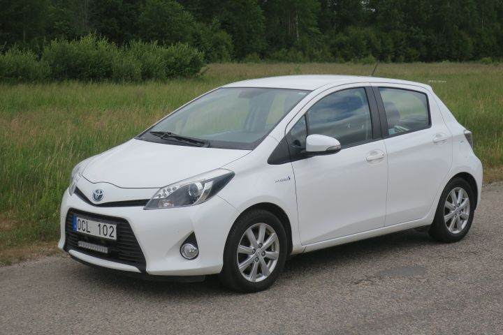

# carDisplay 
Python program which displays relevant data for driving the Toyota Yaris.

## Toyota Yaris XP13M Hybrid 2013

### wanted modifications
- implement this display
    - RPI?
    - Android phone?
- wing
- cool hubcaps
- wheel sleve

## backlog

- make csv file dynamic to match update row
- make shortcut/hotkey/config to activate venv
